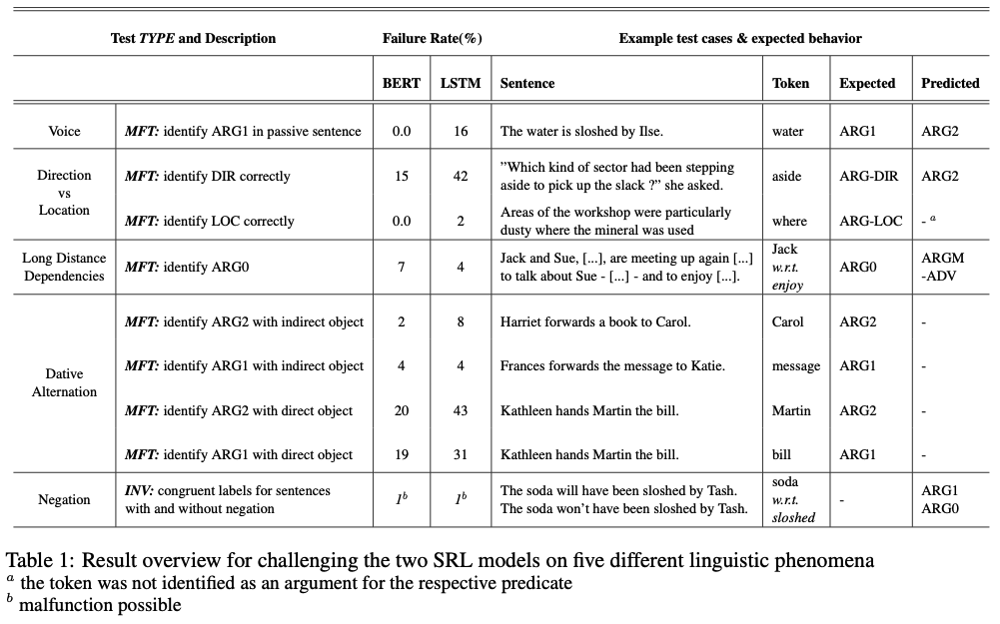

# NLP_Challenging_SRL

## Overview

The task of Semantic Role Labeling (SRL) refers to the Natural Language Processing task of identify- ing the predicate-argument structure in a sentence. In recent years deep neural models have been de- veloped to conduct this task. While the application of such end-to-end models might ease the handling of SRL models, it comes with the offset that those systems are blackboxes which do not allow the user to easily retrace the model’s prediction steps.

One approach to regain interpretability is to an- alyze the structure of those models (e.g. their internal weights) in order to derive correlations of weights at nodes and the predictions. This ap- proach, however, lacks causality in the identified relations (Belinkov and Glass, 2019). Another ap- proach is to test the model’s behavior.

In this paper, we want to conduct such a behav- ioral analysis on two specific SRL models, one being based on Bidirectional Encoder Representa- tions from Transformers (BERT) and one on a Long Short-Term Memory (LSTM) model. In order to do this, we create a challenge set, a list of sen- tences we test on that are designed to specifically target certain linguistic phenomena. The phenom- ena we test on in this paper are voice, direction and location arguments, long distance dependencies, dative alternations and negation. In order to struc- ture these tests, we use CheckList, a conceptual and tool framework to organize behavioral tests for NLP tasks (Ribeiro et al., 2020), to report on our evaluation results.

## Results

